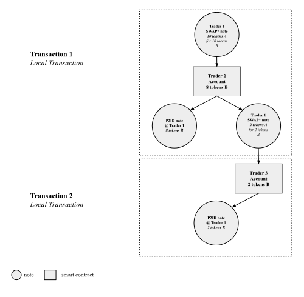

# SPARK-MIDEN-V1

### Settlement of Spot Order Trades with SWAPp

Settlement of spot order trades on Spark-Miden-v1 is achieved through the use of SWAPp (partially fillable swap) notes. SWAPp notes have the following characteristics:

### SWAPp Characteristics
1. Can function as a regular SWAP note (as defined in the Miden-base repository).
2. Allow a user wallet to partially consume them, as long as the consuming wallet has the necessary SWAPp add-on procedures.
3. Are reclaimable by the creator.

### What is Partial Consumption of a SWAPp Note?

Partial consumption means that a SWAPp note allows a user who does not have sufficient liquidity to completely fill the SWAPp order to still execute their trade at the specified ratio of requested tokens in the SWAPp note. 

When partially filling a SWAPp note with liquidity L, the remaining liquidity L1 in the SWAPp note is added to the new outputted SWAPp note.

The process of partially filling a SWAPp note can continue N times until the liquidity in the SWAPp note is completely exhausted.

### Partial SWAPp fulfillment


## SWAPp Note Inputs

The SWAPp note has the same number of inputs as the standard SWAP note in the miden-base repository.

This means there are nine stack elements as inputs to the SWAPp note:

*In the context of Miden, when describing the stack, capitalized words represent four stack elements. Four stack elements are referred to as words.*

```
Inputs: [PAYBACK_RECIPIENT, REQUESTED_ASSET, SWAPp_tag]
```

The payback recipient is the RECIPIENT digest of the P2ID note.

The RECIPIENT digest is defined as:

```
hash(hash(hash(serial_num, [0; 4]), script_hash), input_hash)
```

The REQUESTED_ASSET is defined as:
```
[faucet_id, 0, 0, amount]
```

The SWAPp note is reclaimable by the initial creator of the SWAPp note. After each partial consumption of the SWAPp note, the sender of the note changes. However, since the PAYBACK_RECIPIENT input of the SWAPp note does not change, we can compute the PAYBACK_RECIPIENT hash inside the SWAPp note using the account ID of the currently executing account. If the PAYBACK_RECIPIENT hash matches the SWAPp note input for the PAYBACK_RECIPIENT, this means that the currently executing account is the initial creator.

This is achieved by calling the account::get_id procedure and then computing the PAYBACK_RECIPIENT digest inside the note.

## Output of Partially Consuming a SWAPp Note

When partially consuming a SWAPp note, two notes are outputted:
1. A P2ID note with the requested asset for the SWAPp note creator.
2. A new SWAPp note with L1 liquidity of the asset being sold.

### Running Tests:c
```
cargo test --test mock_integration
```

### Formatting MASM
```
cargo masm-fmt "src/**/*.masm"
```

#### Installing masm-formatter
```
cargo install masm-formatter
```

ratio = amt_a / amt_b
amt_a_out = amt_b_in * ratio